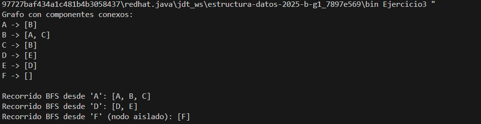
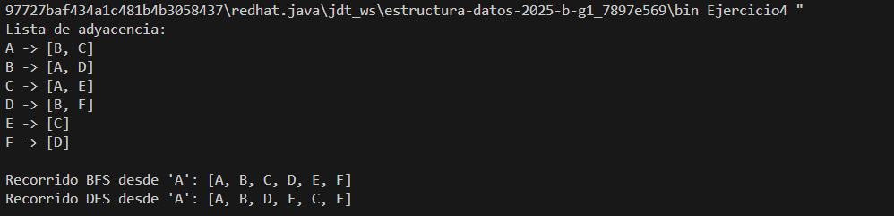

# Taller — Construcción de un Grafo y Recorrido BFS

## Descripción General
En este taller se trabajó con la estructura de datos Grafo y se implementó el algoritmo de recorrido **BFS (Breadth-First Search)**.  
Para el desarrollo de los ejercicios se suministró un código base denominado `Graph.java`, el cual sirvió como soporte para realizar cada actividad.

---

## ¿Qué es un Grafo?
Un **grafo** es una estructura utilizada para representar relaciones o conexiones entre elementos mediante:
- **Nodos (vértices)**: representan entidades u objetos.
- **Aristas (edges)**: representan los enlaces o relaciones entre ellos.

---

## ¿Qué es BFS?
**BFS (Breadth-First Search)** es un algoritmo de búsqueda utilizado para recorrer o explorar grafos, visitando primero los nodos más cercanos al origen (por niveles) antes de avanzar a otros más distantes.

Este algoritmo es útil para:
- Encontrar caminos más cortos
- Detectar componentes conectados
- Realizar búsquedas amplias en estructuras en red

---

## Ejercicios Desarrollados

### **Ejercicio 1 — Red social**
Modelar usuarios como nodos y amistades como aristas.  
Realizar un recorrido BFS desde un usuario seleccionado.

---

### **Ejercicio 2 — Mapa de ciudades**
Representar varias ciudades conectadas mediante rutas y mostrar el recorrido BFS desde una ciudad origen.

---

### **Ejercicio 3 — Componentes conexos**
Probar grafos no conectados y analizar el comportamiento del BFS en este escenario.

---

### **Ejercicio 4 — Comparación BFS vs DFS**
Implementar el algoritmo DFS y comparar el orden de visita respecto a BFS.

---

## Conclusiones
- BFS realiza el recorrido por niveles, lo cual permite analizar conexiones graduales.
- En grafos no conexos, BFS solo recorre el componente donde se inicia.
- BFS y DFS permiten observar diferencias claras en el orden de recorrido.
- El archivo `Graph.java` facilitó la creación y prueba de estructuras de grafos.

---

## Autor
**Jeronimo Diaz**  
Ingeniería de Sistemas — 2025
